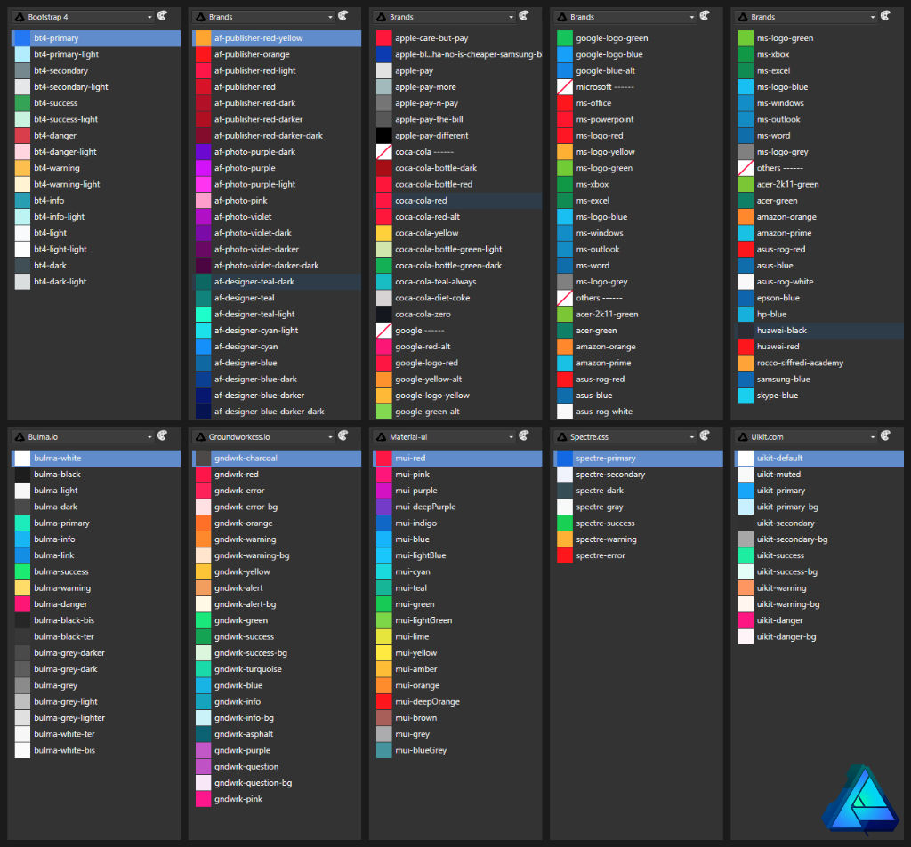

# d-af-palette
[Affinity Designer](https://affinity.serif.com/fr/designer/) Palettes files

---

## What is it ?
In my work, like many people, i need to make lots of website sketch/présentation created with common Frameworks like Bootstrap or others. I made this with the excellent software [Affinity Designer](https://affinity.serif.com/fr/designer/), and so, here are my own palettes created for this last.

---

## Palettes details

### Web/CSS Frameworks :
- Bootstrap 4.afpalette       : 16 colors from [Bootstrap 4](https://getbootstrap.com/) default theme {prefix **bt4-**}
- Bulma.io.afpalette          : 19 colors from [Bulma](https://bulma.io/) default theme {prefix **bulma-**}
- Groundworkcss.io.afpalette  : 22 colors from [GroundWork](https://groundworkcss.github.io/) default theme {prefix **gndwrk-**}
- Material-ui.afpalette       : 19 colors from [Material UI](https://material-ui.com/) default theme {prefix **mui-**}
- Spectre.css.afpalette       :  7 colors from [Spectre](https://picturepan2.github.io/spectre/) default theme {prefix **spectre-**}
- Uikit.com.afpalette         : 12 colors from [UI Kit](https://getuikit.com/) default theme {prefix **uikit-**}

### Others :
- Brands.afpalette            : 70+ brands colors (Affinity, Apple, Google, Microsoft, Amazon, Coca-Cola...)
- FlatUI 2 Japan.afpalette    : 20 colors of Japan Flat UI 2
- Old Colors.afpalette        : 60+ old/vintage colors 

### Human Body
- Human Body Bones.afpalette    : 6 colors for human bones 
- Human Body Hairs.afpalette    : 70+ colors for human hairs
- Human Body Intimity.afpalette : 25 colors for human private parts 
- Human Body Skins.afpalette    : 26 colors for human skins

---

## Screenshots

